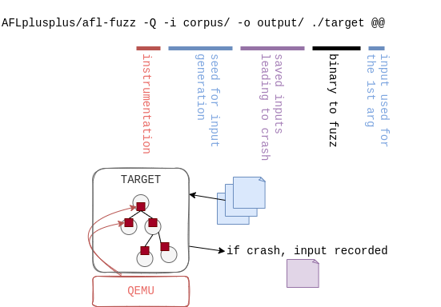

# Advanced binary fuzzing using AFL++-QEMU and libprotobuf: a practical case of grammar-aware in-memory persistent fuzzing

Imagine you identified a function that may be vulnerable in a binary for which
you do **not have the source code**. To help you identify vulnerabilities, you
want to **fuzz it with the most relevant AFL++ configuration possible**.
However, as implementing such tooling in practice is not trivial, we decided to
summarize our experience and approach in a blog post to help future endeavors.

This blog post describes how to **benefit from advanced features** of AFL++-QEMU
to start grammar-aware in-memory persistent fuzzing on **a practical case** step
by step. We provide all scripts and data (as well as an ELF target) to follow
along as you read this post by experimenting on your own. Though encouraged, it
is entirely optional; you can also enjoy this post by simply reading through,
and we hope you'll still learn from it!


## Binary-only fuzzing: some recurring questions

QEMU is one of the backends supported by AFL++ to handle the instrumentation
of binary-only targets.

In practice, this means that, contrary to a target for which the source code
is available, you do not recompile the source to obtain an instrumented
binary. Instead, AFL++ executes the original binary using a patched version
of QEMU's [User Mode Emulation](https://qemu-project.gitlab.io/qemu/user/index.html)
to collect coverage information.

**Notes:**
- if you want to learn more about QEMU internals, make sure to checkout
  [this series of posts](https://airbus-seclab.github.io/qemu_blog).
- in this post, we only explore the QEMU backend. However, most concepts
  detailed here should be applicable to other available
  [AFL++ backends](https://github.com/AFLplusplus/AFLplusplus/blob/stable/docs/fuzzing_binary-only_targets.md).

A very basic execution of fuzzing with QEMU mode (using the `-Q` flag) is
illustrated in the following figure:



With QEMU mode, different aspects are configurable to optimize fuzzing
performance and coverage.
The [official documentation](https://github.com/AFLplusplus/AFLplusplus/blob/stable/qemu_mode/README.md)
describes all the features available. Among them:
be clear what users have to be able to do to run all steps (e.g. apply patches, why they are needed, etc)
- Instrumentation and coverage:
  - `AFL_INST_LIBS`
  - `AFL_QEMU_INST_RANGES`
- Mutations:
  - `AFL_CUSTOM_MUTATOR_LIBRARY`
  - `AFL_CUSTOM_MUTATOR_ONLY`
- Execution:
  - `AFL_ENTRYPOINT`
  - `AFL_QEMU_PERSISTENT_ADDR`/`AFL_QEMU_PERSISTENT_ADDR_RET`
  - `AFL_QEMU_PERSISTENT_HOOK`
  - `AFL_DISABLE_TRIM`
  - `AFL_DEBUG`/`AFL_DEBUG_CHILD`

However, going **from theory to practice** sometimes appears **tedious** and
often raises some **recurring questions** such as:

- What piece of code do we want covered by the instrumentation?
- What is the best choice for the fuzzer entrypoint?
- What does moving the entrypoint imply on the format of the test cases?
- How can our campaign benefit from the advanced features available in AFL++ to
  improve performance?

The aim of this article is to see together **how we answered these questions on
a practical case**, from basic configuration to a setup **optimized for the
target**, which could be **reused and applied to other similar projects**.


## Target

### A weak X509 parser

The [example](https://github.com/airbus-seclab/AFLplusplus-blogpost/tree/main/src) we chose is inspired by real-life targets we encountered
during security evaluations (but cannot redistribute for obvious reasons). It is
a binary which expects a filename as input and tries to parse the corresponding
file's content as an X509 certificate.

It contains only a few basic functions:

- `main`: the main function which takes a file as input and calls `parse_cert`
  with this file as argument;
- `parse_cert`: calls `read_file` and gives the read buffer as argument to
  `parse_cert_buf`;
- `read_file`: opens the file, reads it and returns its content;
- `parse_cert_buf`: parses a buffer as a X509 certificate with `d2i_X509` from
  the `openssl` C library, tries to get the CN and print it.

Intentionally, this target contains a trivial vulnerability which we want to
reach during our fuzzing campaign: a stack-based buffer overflow in
`parse_cert_buf`:

```c
int parse_cert_buf(const unsigned char *buf, size_t len) {
    X509 *cert;
    char cn[MAX_CN_SIZE];

    cert = d2i_X509(NULL, &buf, len);
    ...
    char *subj = X509_NAME_oneline(X509_get_subject_name(cert), NULL, 0);
    strcpy(cn, subj);  // Oops
    printf("Got CN='%s' from certificate\n", cn);
    ...
}
```

Intentionally too, a dummy `init` function is added at the beginning of the
main to simulate an initialization phase which would take time and make the
target slow to spin up.

### Exploring the target

In real life, targets are obviously not as simple as our
[weak X509 parser](https://github.com/airbus-seclab/AFLplusplus-blogpost/tree/main/src/target.c). Indeed, a good fuzzing campaign of a
binary-only target always starts with a phase of reverse engineering to:

- understand the target, how it works, how it interacts with its environment,
  etc.
- identify interesting features to study;
- find functions which might prove to be good targets for fuzzing;
- analyze the call context, structures, user-controlled arguments, etc.
- build a harness or toolchain to call the target function with proper arguments
  and the fuzzed input;
- generate an initial corpus to get the fuzzer started.

Though some tools (such as [fuzzable](https://github.com/ex0dus-0x/fuzzable))
exist to help with some of these steps, they most often remain a required,
tedious, and manual part of fuzzing binary targets.

Since our example is straightforward, it should not take you too long to find
the vulnerable code, the call trace, and to **identify the function of
interest**: `parse_cert_buf`.

```asm
00000000000013d4 <parse_cert_buf>:
    13d4: 55                    push   rbp
    13d5: 48 89 e5              mov    rbp,rsp
    13d8: 53                    push   rbx
    13d9: 48 83 ec 68           sub    rsp,0x68
...
    1473: 48 89 d6              mov    rsi,rdx
    1476: 48 89 c7              mov    rdi,rax
    1479: e8 92 fc ff ff        call   1110 <strcpy@plt>
...
    14d9: b8 00 00 00 00        mov    eax,0x0
    14de: 48 8b 5d f8           mov    rbx,QWORD PTR [rbp-0x8]
    14e2: c9                    leave
    14e3: c3                    ret
```

**Note:** The addresses you obtain might change depending on your compiler, its
version, the options used etc. As long as they are consistent, don't worry about
it!

Now, for the best part: fuzzing this target! For that, follow along the rest
of this post :)


## Corpus

### Collecting inputs

Before anything, we need to collect sample input files to build a corpus.
Indeed, the [AFL++ documentation](https://github.com/AFLplusplus/AFLplusplus/blob/stable/docs/fuzzing_in_depth.md#a-collecting-inputs)
states that:

> To operate correctly, the fuzzer requires one or more starting files that
> contain a good example of the input data normally expected by the targeted
> application.

In our case, since the target parses certificates, we simply generate one using
openssl:

```sh
$ openssl req -nodes -new -x509 -keyout key.pem -out cert.pem
```

To make things simpler, we already provide one in the [corpus](https://github.com/airbus-seclab/AFLplusplus-blogpost/tree/main/step0/corpus)
folder.

### Pre-processing corpus

Before using this corpus, we can:

1. Only retain input samples that lead to distinct execution paths (using
   `afl-cmin`);
2. Minimize each input sample to preserve its distinct execution path while
   making its size as small as possible (using `afl-tmin`). This will make
   future mutations more effective.

We combined these two steps into a single
[build_corpus.sh](https://github.com/airbus-seclab/AFLplusplus-blogpost/tree/main/step0/build_corpus.sh) script.

Now, assuming you followed the steps in `README.md` to build AFL++, you can go
ahead and run `build_corpus.sh` from the `step0` directory. This will go through
the corpus minimization steps and get you set up for the next steps.

We should now have all the pre-requisites to *actually* run AFL++. We'll dive in
the next step, so keep following along!


## Instrumentation

AFL++ is a "coverage-guided" fuzzer, meaning that the mutation strategy takes
code coverage of previous executions into account to generate new inputs. To
build coverage information, AFL++-QEMU needs to know which basic blocks have
been reached. This is achieved by instrumenting each basic block to track when
it is hit.

### Default setup ([step0](https://github.com/airbus-seclab/AFLplusplus-blogpost/tree/main/step0))

By launching AFL++-QEMU by default, as in the [step0](https://github.com/airbus-seclab/AFLplusplus-blogpost/tree/main/step0), **all the basic
blocks of the target** are instrumented, and shared libraries are **not**
included in the instrumentation.

Take note of the `exec speed` indicator: you can keep an eye on how it evolves
with each step of our post.

### Instrumentation tuning ([step1](https://github.com/airbus-seclab/AFLplusplus-blogpost/tree/main/step1))

It is common to study targets for which it is interesting to change this default
instrumentation behavior. Reasons can include:

- you are interested in covering all paths possible in the libraries imported by
  the main binary;
- you want to exclude specific parts of a library for which security has already
  been tested;
- instrumenting a full huge binary can reduce the execution speed.

To see the range of instrumentation, the following options are available:

- `AFL_INST_LIBS`;
- `AFL_QEMU_INST_RANGES`;
- `AFL_CODE_START`;
- `AFL_CODE_END`.

In our example, while it is crucial to instrument `parse_cert_buf`, it is less
relevant to instrument `main` for example, nor shared libraries (e.g.
`libssl.so`). To configure this, we limit the instrumentation to the function of
interest only. This is done by setting `AFL_QEMU_INST_RANGES` (see
[step1](https://github.com/airbus-seclab/AFLplusplus-blogpost/tree/main/step1)):

- starting at the address of the first instruction of `parse_cert_buf`;
- ending at the address of the last instruction of `parse_cert_buf`.

**Note:** this could also be done using `AFL_CODE_START` and `AFL_CODE_END` in
our case. However, `AFL_QEMU_INST_RANGES` is more flexible as it allows
specifying multiple ranges to instrument, so we favor this environment variable
instead.

These addresses can be determined manually, or deduced from the `objdump`
output:

```sh
# The base address at which QEMU loads our binary depends on the target
# See https://github.com/AFLplusplus/AFLplusplus/blob/stable/qemu_mode/README.persistent.md#21-the-start-address
case $(file "$target_path") in
  *"statically linked"*)
    QEMU_BASE_ADDRESS=0
    ;;
  *"32-bit"*)
    QEMU_BASE_ADDRESS=0x40000000
    ;;
  *"64-bit"*)
    QEMU_BASE_ADDRESS=0x4000000000
    ;;
  *) echo "Failed to guess QEMU_BASE_ADDRESS"; exit 1
esac

# We use objdump to parse our target binary and obtain the address and size of a given function
function find_func() {
    objdump -t "$target_path" | awk -n /"$1"'$/{print "0x"$1, "0x"$5}'
}

# Some environment variables for AFL++ must be hex encoded
function hex_encode() {
    printf "0x%x" "$1"
}

read fuzz_func_addr fuzz_func_size < <(find_func "parse_cert_buf")
inst_start=$(hex_encode $(("$QEMU_BASE_ADDRESS" + "$fuzz_func_addr")))
inst_end=$(hex_encode $(("$inst_start" + "$fuzz_func_size")))
export AFL_QEMU_INST_RANGES="$inst_start-$inst_end"
```

```sh
$ find_func "parse_cert_buf"
0x00000000000013d4 0x0000000000000110
```

By enabling AFL++-QEMU's debug mode (`AFL_DEBUG`), we can check that the
**instrumentation range matches what we want**:

```
Instrument range: 0x40000013d4-0x40000014e4 (<noname>)
```

From now on, our target is **instrumented only for parts of interest and ready
to be fuzzed**.


## Entrypoint

### Concept and default behavior

When fuzzing, AFL++ runs the target until a specific address (the AFL
entrypoint) is reached, and then forks from there for each iteration. By
default, the AFL entrypoint is set to the target's entrypoint (in our
example, `target`'s `_start` function).

Indeed, in the default configuration, AFL++ prints the following message:

```sh
# from the step0 directory
$ AFL_DEBUG=1 ./fuzz.sh | grep entrypoint
AFL forkserver entrypoint: 0x40000011a0
```

Disassembling `target` with `objdump` confirms the entrypoint is set to the
address of the `_start` function:

```sh
# from the step0 directory
$ objdump -d --start-address=0x11a0 ../src/target | head -n20
00000000000011a0 <_start>:
    11a0: 31 ed                 xor    ebp,ebp
    11a2: 49 89 d1              mov    r9,rdx
    ...
    11b4: 48 8d 3d fa 03 00 00  lea    rdi,[rip+0x3fa]         # 15b5 <main>
    11bb: ff 15 1f 2e 00 00     call   QWORD PTR [rip+0x2e1f]  # 3fe0 <__libc_start_main@GLIBC_2.34>
    ...
```

With this configuration, the whole target runs for each iteration.

### Choice of positioning ([step2](https://github.com/airbus-seclab/AFLplusplus-blogpost/tree/main/step2))

In some cases (like in our example), the initialization phase of the program may
take time. Because initialization is performed for each iteration, there is a
direct impact on fuzzing speed. This is precisely the type of situation that the
`AFL_ENTRYPOINT` option is intended to address.

Indeed, `AFL_ENTRYPOINT` can be set to a relevant custom value which will:

- run the initialization phase only once up until the `AFL_ENTRYPOINT` address
  is reached;
- stop the target at the `AFL_ENTRYPOINT` and synchronize with the fuzzer;
- let the fuzzer snapshot the target's state and then proceed with execution
  after the `AFL_ENTRYPOINT` address.

This way, the initialization phase is only run once, before the fork server runs
all the iterations, and fuzzing is sped-up.

In our example, the choice of positioning of `AFL_ENTRYPOINT` was really trivial
since:

- the `init` code doesn't need to be fuzzed;
- the `init` phase is deterministic;
- the function for which fuzzing is relevant has already been determined
  (`parse_cert`).

We can thus set the `AFL_ENTRYPOINT` to the start of the `parse_cert` function
(see [step2](https://github.com/airbus-seclab/AFLplusplus-blogpost/tree/main/step2)):

```sh
# Define a custom AFL++ entrypoint executed later than the default (the binary's
# entrypoint)
read fuzz_func_addr fuzz_func_size < <(find_func "parse_cert")
export AFL_ENTRYPOINT=$(hex_encode $(("$QEMU_BASE_ADDRESS" + "$fuzz_func_addr")))
```

In this configuration, AFL++ prints the following message:

```sh
$ AFL_DEBUG=1 ./fuzz.sh | grep entrypoint
AFL forkserver entrypoint: 0x40000014e4
```

We can confirm that this is the address of `parse_cert` by disassembling
`target` with `objdump`:

```sh
$ objdump -d --start-address=0x14e4 ../src/target | head -n10
00000000000014e4 <parse_cert>:
    14e4: 55                    push   rbp
    14e5: 48 89 e5              mov    rbp,rsp
    14e8: 48 83 ec 20           sub    rsp,0x20
```

### Impact on performance

Running the fuzzer lets us see the avantage of adjusting the `AFL_ENTRYPOINT`:

- with the default `AFL_ENTRYPOINT`:

  ```
  exec speed : 18.24/sec (zzzz...)
  ```
- after having adjusted the `AFL_ENTRYPOINT` (in order to skip the `init`
  phase):

  ```
  exec speed : 1038/sec
  ```


This illustrates that **the choice of `AFL_ENTRYPOINT` is crucial** for the
maximization of the number of tests per second the fuzzer can execute.

In the next section, we will see performance can still be further improved
by leveraging yet another AFL++ feature: persistent mode.


## Persistence

### Persistent mode ([step3](https://github.com/airbus-seclab/AFLplusplus-blogpost/tree/main/step3))

#### Environment variables

"Persistent mode" is a feature allowing AFL++ to avoid calling `fork` for each
iteration. Instead, it saves the child's state once it reaches a certain
address (`AFL_QEMU_PERSISTENT_ADDR`), and restores this state once it reaches
another address (`AFL_QEMU_PERSISTENT_RET`).

**Note:** instead of `AFL_QEMU_PERSISTENT_RET`,
`AFL_QEMU_PERSISTENT_RETADDR_OFFSET` may be used. If none of these values is
set, AFL++ will instead stop once the first `ret` instruction is reached (only
if `AFL_QEMU_PERSISTENT_ADDR` points to the start of a function, otherwise you
*must* set the value manually).

"Restoring" the state may mean "restoring registers" (`AFL_QEMU_PERSISTENT_GPR`)
and/or "restoring memory" (`AFL_QEMU_PERSISTENT_MEM`). As restoring the memory
state is costly, it should only be done when necessary; keep an eye on the
stability value when fuzzing to see if enabling this feature is necessary or
not.

Even when using persistent mode, AFL++ will still call `fork` from time to time
(every `AFL_QEMU_PERSISTENT_CNT` iterations, or 1000 by default). If stability
is high enough, increasing this value may improve performance (the max value is
10000).

#### Applied to our example

In our case, we can start by setting `AFL_QEMU_PERSISTENT_ADDR` to the same
value as `AFL_ENTRYPOINT` (the address of the `parse_cert` function). This way,
AFL++ will restore our process to its state just before it reads the content of
the input file.

Here is the relevant section from `afl_config.sh`:

```sh
read fuzz_func_addr fuzz_func_size < <(find_func "parse_cert")
export AFL_QEMU_PERSISTENT_ADDR=$(hex_encode $(("$QEMU_BASE_ADDRESS" + "$fuzz_func_addr")))
export AFL_QEMU_PERSISTENT_GPR=1
export AFL_QEMU_PERSISTENT_CNT=10000
```

In our example, stability remains at 100% without having to restore memory
state, so we only set `AFL_QEMU_PERSISTENT_GPR`. We also increase
`AFL_QEMU_PERSISTENT_CNT` to its maximum value, as this does not negatively
impact our stability.

You can directly test this using the files provided in the
[step3 folder](https://github.com/airbus-seclab/AFLplusplus-blogpost/tree/main/step3). You can also confirm for yourself that the performance
boost described in the AFL++ documentation is really there: we get more than 10
times more iterations per second according to our tests!

### In-memory fuzzing ([step4](https://github.com/airbus-seclab/AFLplusplus-blogpost/tree/main/step4))

Despite using persistent mode, there are still operations which are needlessly
performed by our target before reaching the fuzzed function, notably opening and
reading the content of the file generated by the fuzzer. Instead, we can use
"in-memory fuzzing" to skip this step by directly reading the input case from
the fuzzer's memory!

#### Hook

To do so, we have to implement a "hook". It is actually extremely simple, and
its source code is provided in [this file](https://github.com/airbus-seclab/AFLplusplus-blogpost/tree/main/src/hook/hook.c):

- we define an `afl_persistent_hook_init` function which declares whether we
  want to use in-memory fuzzing or not;
- more interesting, we define an `afl_persistent_hook` function which can
  override register values and memory at every iteration, right before the
  `AFL_QEMU_PERSISTENT_ADDR` address is reached. All we have to do is override
  the memory containing the buffer to parse and set its length in the right
  register.

**Note:** you can identify which registers to use by running `gdb` and breaking
at the start of the target function, or directly by looking at the disassembled
code.

This hook should be compiled as a shared library, which AFL++ will load at
runtime.

#### Environment variables

To instruct AFL++ to use our hook, we simply set `AFL_QEMU_PERSISTENT_HOOK` to
the path of our `.so` file:

```sh
export AFL_QEMU_PERSISTENT_HOOK="$BASEPATH/src/hook/libhook.so"
```

As discussed, we want to change `AFL_QEMU_PERSISTENT_ADDR` to skip the call to
`read_file` during iterations. There are two options here:

- either we set it at the start address of `base64_decode`. In this case, we
  will also be fuzzing the `base64_decode` function;
- or we set it at the start of `parse_cert_buf`. In this case `base64_decode`
  will not be fuzzed.

  Because `base64_decode` is implemented by a trusted external library which we
  don't want to fuzz (in this case, OpenSSL) intend to fuzz specifically, we'll
  pick the second option.

Thus, we can move the `AFL_QEMU_PERSISTENT_ADDR` to the address of
`parse_cert_buf`:

```sh
read fuzz_func_addr fuzz_func_size < <(find_func "parse_cert_buf")
export AFL_QEMU_PERSISTENT_ADDR=$(hex_encode $(("$QEMU_BASE_ADDRESS" + "$fuzz_func_addr")))
```

#### Input format

Moving `AFL_QEMU_PERSISTENT_ADDR` has an impact on our corpus. Indeed, the
buffer generated by the fuzzer is now directly used in `parse_cert_buf` (without
ever being passed to `base64_decode`). This means we'll have to rebuild our
corpus. In our case, it is quite easy: we just need to decode the base64 files
from the previous corpus and save them as raw binary files.

#### Applied to our example

A quirk of this approach is that, because we are no longer reading data from a
file, the fuzzer no longer needs to create one on disk. However, remember that
our target program expects to read from one or it will immediately exit. Since
the content of this file is no longer relevant (because `read_file` is no longer
called), we can just manually create an empty placeholder before calling our
program.

You can find this new setup in the [step4 folder](https://github.com/airbus-seclab/AFLplusplus-blogpost/tree/main/step4).

### Impact on performance

Overall, in our tests, enabling persistent mode improves performance by a factor
of 10 (don't always expect such a boost in real-life scenarios though!), and the
in-memory hook yields an additional twofold improvement:

```
exec speed : 25.6k/sec
```

**Note:** as execution speed is not the only metric that matters, you should of
course keep an eye on other indicators such as stability, newly discovered paths,
coverage, etc.


## Grammar-aware mutator ([step5](https://github.com/airbus-seclab/AFLplusplus-blogpost/tree/main/step5))

### Motivations

To recap what we have achieved so far:

- we setup AFL++ to fuzz a binary-only target using QEMU;
- we configured instrumentation to only cover relevant addresses;
- we tweaked the AFL++ entrypoint and enabled persistent mode to shave off
  initialization time.

In many cases, such a configuration - when combined with multiprocessing which
we will briefly touch on later - is enough to run a successful campaign.
However, for this example, we decided to fuzz a target handling a highly
structured data format. In such a scenario, it may be interesting to introduce
new ways of mutating the input data.

Indeed, another tunable aspect of AFL++ is the generation and mutation logic.
AFL++ has built-in support for a set of simple (but nonetheless very effective)
mutations:

- random bit flips;
- random byte flips;
- arithmetics;
- etc.

In most cases, these mutations are sufficient to explore the code to fuzz. Some
data formats have internal constraints that will result in samples being
prematurely rejected because these are not met. This is for instance the case
for ASN1 which the format used in our chosen example. Generating mutations
without accounting for these constraints justs lead to most samples being
immediately without achieving any added coverage. This way, the fuzzing campaign
will **require time before converging** to
relevant generated cases and users would be prone to guide the fuzzer to
generate valid inputs and let the fuzzer explore what is done by the target with
the effective payload.

To address this type of situation, AFL++ allows user to provide their own custom
mutators. As detailed in the [official documentation](https://aflplus.plus/docs/custom_mutators),
a **custom mutator can be plugged to AFL++** as long as this mutator implements
the required API functions.

### Implementation

Several options exist to implement grammar-aware mutators in AFL++, one of them
being the [Grammar Mutator part of the AFL++ project](https://github.com/AFLplusplus/Grammar-Mutator),
however it doesn't offer support for ASN1. Support for ASN1 is what steered us
towards [libprotobuf](https://github.com/google/libprotobuf-mutator), which
[handles ASN.1](https://github.com/google/fuzzing/tree/master/proto/asn1-pdu).

We took inspiration from
[the official documentation](https://github.com/AFLplusplus/AFLplusplus/blob/stable/docs/custom_mutators.md)
and [existing skeletons](https://github.com/P1umer/AFLplusplus-protobuf-mutator)
to build the "glue" between AFL++ and our custom mutator.

The result lives in [custom_mutator.cpp](https://github.com/airbus-seclab/AFLplusplus-blogpost/tree/main/src/mutator/custom_mutator.cpp), and
implements the following functions from the AFL++ API:

* `afl_custom_init` to initialize our custom mutator;
* `afl_custom_fuzz` to mutate the input using our protobuf mutator;
* `afl_custom_post_process` to perform post-processing on the mutated data to
  ensure our target receives correctly formatted input;
* `afl_custom_deinit` to cleanup everything.

### Input format

Indeed, the `afl_custom_post_process` function plays an important role: our
custom mutator is based on libprotobuf, and thus needs protobuf data as
input. However, our target can only parse ASN.1 data, we thus need to convert
data from protobuf to ASN.1. Thankfully, the protobuf mutator already
implements this feature in `x509_certificate::X509CertificateToDER`.

An overview of this whole process is presented below:


As before, we need to adjust the format of the files in our corpus to align with
our fuzzing harness. This time around we need to convert our ASN.1 DER files to
protobuf. To that end, we implemented a custom script
([asn1_to_protobuf.py](https://github.com/airbus-seclab/AFLplusplus-blogpost/tree/main/src/mutator/asn1_to_protobuf.py)), which is run once
by this step's [build_corpus.sh](https://github.com/airbus-seclab/AFLplusplus-blogpost/tree/main/step4/build_corpus.sh).

#### Environment variables

With this, all that is left is to instruct AFL++ to use our custom mutator. For
this, we simply set `AFL_QEMU_PERSISTENT_HOOK` to the path of our `.so` file:

```sh
export AFL_CUSTOM_MUTATOR_LIBRARY="$BASEPATH/libmutator.so"
```

We also disable all default mutations and trimming performed by AFL++:

```sh
export AFL_DISABLE_TRIM=1
export AFL_CUSTOM_MUTATOR_ONLY=1
```

#### Applied to our example

You can find this new setup in the [step5 folder](https://github.com/airbus-seclab/AFLplusplus-blogpost/tree/main/step5).

### Impact

This time, it's not about improving performance, but rather about reaching
deeper paths. On our example, which is a very small target, it is quite
difficult to measure this impact. However, this would usually be done by
comparing coverage and checking if new branches are being reached using the
custom mutator.

However, you don't need to choose between using a custom mutator and
using the default AFL++ mutations: you can have the best of both worlds by
running several instances of the fuzzer, as we'll discuss in the next step.


## Multiprocessing ([step6](https://github.com/airbus-seclab/AFLplusplus-blogpost/tree/main/step6))

This step is where we bring everything together to run our actual fuzzing
campaign. Indeed, in a real campaign, you would not limit yourself to fuzzing on
only one core/thread/machine. Thankfully, AFL++ handles running multiple
instances in parallel.

However, as stated in [the documentation](https://github.com/AFLplusplus/AFLplusplus/blob/stable/docs/fuzzing_in_depth.md#c-using-multiple-cores),
it is not always useful to run too many instances at once:

> On the same machine - due to the design of how AFL++ works - there is a
> maximum number of CPU cores/threads that are useful, use more and the overall
> performance degrades instead. This value depends on the target, and the limit
> is between 32 and 64 cores per machine.

It should be noted that, even before hitting that limit, the increase in
performance is not proportional (doubling the number of cores does not double
the number of executions per second): an additional overhead is required to
synchronize processes.

### Varying configuration, mutators, schedules

When running several instances of the fuzzer, coverage can be optimized by using
a variety of strategies and configurations in parallel. Because our intent is
not to mirror the official AFL++ documentation, we will refer your instead to
[this section](https://github.com/AFLplusplus/AFLplusplus/blob/stable/docs/fuzzing_in_depth.md#c-using-multiple-cores)
which describes how to use multiple cores while fuzzing.

Nevertheless, as the page is mostly aimed at fuzzing targets where source code
is available, some aspects need to be tweaked for binary-only fuzzing.

### Binary-only specificities

When fuzzing targets for which source code is available, many features (e.g.
ASAN, UBSAN, CFISAN, COMPCOV) require recompiling the target with specific
options. Despite recompilation not being an option when dealing with a binary
target, some of these features are nonetheless available in QEMU (as documented
[here](https://github.com/AFLplusplus/AFLplusplus/blob/stable/docs/fuzzing_binary-only_targets.md#qemu-mode)).

For example, `AFL_USE_QASAN` allows automatically injecting a library using
`LD_PRELOAD` to use
[ASAN with QEMU](https://github.com/AFLplusplus/AFLplusplus/blob/stable/qemu_mode/libqasan/README.md).
Similarly, `AFL_COMPCOV_LEVEL` allows using
[COMPCOV with QEMU](https://github.com/AFLplusplus/AFLplusplus/blob/stable/qemu_mode/libcompcov/README.md),
without the need to recompile the target.

### Multi-device setup

For larger fuzzing campaigns, you may use several hosts, each running multiple
fuzzer processes. This setup is actually fairly simple, and is well covered in
the [official documentation](https://github.com/AFLplusplus/AFLplusplus/blob/stable/docs/fuzzing_in_depth.md#d-using-multiple-machines-for-fuzzing).
For the sake of simplicity and reproducibility, we did not use multiple machines
in the context of this post.

### Applied to our example

From the start of this blogpost, the input format and target function changed.
You can find a summary of these changes in the following table:

| Configuration      | Targeted function    | Expected input format |
|--------------------|----------------------|-----------------------|
| Default entrypoint | `main()`             | `base64(valid ASN1)`  |
| Custom entrypoint  | `main()`             | `base64(valid ASN1)`  |
| In-memory fuzzing  | `parse_cert_buf()`   | `ASN1 / DER`          |
| Custom mutator     | `parse_cert_buf()`   | `protobuf`->`ASN1`    |

In this step, we run an instance with our custom mutator, and several instances
without this mutator. Thus, we need one corpus in ASN.1 (`corpus_unique`), and
one in protobuf (`corpus_protobuf_unique`), with separate output directories.

An example of such multi-corpus setup is available in the
[step6 folder](https://github.com/airbus-seclab/AFLplusplus-blogpost/tree/main/step6). Note that, contrary to other steps, most interesting
changes are in the `fuzz.sh` file rather than in `afl_config.sh`.


## Prospects on evaluating a campaign

After starting a campaign, you might have to monitor it, evaluate its
efficiency, and investigate its results. This is out of scope of this post,
and the [official documentation](https://github.com/AFLplusplus/AFLplusplus/blob/stable/docs/fuzzing_in_depth.md)
gives various details which we don't aim to repeat here. However, to give you an
idea, we will quickly brush over some of these issues.

### Monitoring a campaign

AFL++ provides the following tools to monitor running instances' status:

* `afl-whatsup`, which shows the status of instances of the fuzzer running in
  the background:

  ```bash
  $ afl-whatsup -s output
  Summary stats
  =============
         Fuzzers alive : 4
        Total run time : 4 minutes, 0 seconds
           Total execs : 1 millions, 849 thousands
      Cumulative speed : 30829 execs/sec
         Average speed : 7707 execs/sec
         Pending items : 0 faves, 0 total
    Pending per fuzzer : 0 faves, 0 total (on average)
         Crashes saved : 3
  Cycles without finds : 204/26/1066/264
    Time without finds : 1 minutes, 26 seconds
  ```
* `afl-plot`, which can plot the evolution of a specific instance's metrics over
  time:

  ```bash
  $ afl-plot output/afl-main /tmp/plot
  ```

  

### Prospects on evaluating a campaign

Checking coverage is another matter, with various particularities for
binary-only targets. It is out of scope of this particular post, but you can
find interesting resources
[in the official documentation](https://github.com/AFLplusplus/AFLplusplus/blob/stable/docs/fuzzing_in_depth.md#g-checking-the-coverage-of-the-fuzzing).

A typical command in the context of our [step6 folder](https://github.com/airbus-seclab/AFLplusplus-blogpost/tree/main/step6) would be the
following:

```bash
$ afl-showmap -Q -C -i "$output_path"/afl-main/queue -o afl-main.cov -- "$target_path" /tmp/.afl_fake_input
```

### Investigating crashes and timeouts

Once AFL++ identifies a crash or a hang, it will save the input which triggered
it in a dedicated folder in your output directory so you can reproduce it.

Useful tools to understand these results can be:

* `afl-tmin` to obtain a minimal test-case reproducing the crash;
* [Lighthouse](https://github.com/gaasedelen/lighthouse) to explore coverage of
  a particular case;
* [Valgrind](https://valgrind.org) to investigate memory issues;
* and probably many more!

In addition, for cases discovered by the custom mutator, the inputs will be in
the protobuf format, which can't easily be replayed directly on the target. For
that, we implemented a simple program which allows converting protobuf back to
ASN.1 (see [protobuf_to_der.cpp](https://github.com/airbus-seclab/AFLplusplus-blogpost/tree/main/src/mutator/protobuf_to_der.cpp)).


## Where we've gotten to so far

Our aim throughout this post was to highlight our methodology, explain AFL++
concepts, and provide a skeleton to fuzz binary-only targets. This led us to
make choices according to our target and our own experience, which might not be
relevant in other cases. In particular, other grammar mutators might be
simpler to implement (e.g. [Grammar Mutator](https://github.com/AFLplusplus/Grammar-Mutator)
if it supports the right grammar).

However, configuring in-memory persistence, tuning the bespoke grammar-aware
mutations, and implementing multi-processing, we achieved to run a fuzzing
campaign with interesting execution speed and coverage.

Obviously, this is only the beginning of the story: running the fuzzing campaign
itself and analyzing results comes with its own set of new questions and fun!


## Bibliography

### Tools

- AFL++ - <https://github.com/AFLplusplus/AFLplusplus>
- QEMU - <https://gitlab.com/qemu-project/qemu>
- Grammar Mutator, AFL++ grammar-based custom mutator - <https://github.com/AFLplusplus/Grammar-Mutator>
- Nautilus, grammar-based fuzzer with AFL-QEMU support - <https://github.com/nautilus-fuzz/nautilus>
- AFL++ protobuf mutator skeleton - <https://github.com/P1umer/AFLplusplus-protobuf-mutator>

### Papers

- AFL++ documentation - <https://github.com/AFLplusplus/AFLplusplus/blob/stable/docs/fuzzing_in_depth.md>
- AFL++ documentation on binary-only fuzzing - <https://github.com/AFLplusplus/AFLplusplus/blob/stable/docs/fuzzing_binary-only_targets.md>
- Series of posts about QEMU internals - <https://airbus-seclab.github.io/qemu_blog>
- Seed Selection for Successful Fuzzing - <https://hexhive.epfl.ch/publications/files/21ISSTA2.pdf>
- Fuzz Testing: Choosing a Seed File for AFL - <https://medium.com/fuzzstation/fuzz-testing-choosing-a-seed-file-for-afl-fee4a09753c2>
- What Applications Should Be Fuzz Tested? - <https://medium.com/fuzzstation/what-applications-should-be-fuzz-tested-e83c77aec84a>
- Preparing an Application for AFL-Fuzz - <https://medium.com/fuzzstation/preparing-an-application-for-afl-fuzz-a2a838c949cb>
- AFL Mutation Graph tool - <https://github.com/adrianherrera/afl-mutation-graph>
- The Fuzzing Book: Greybox Fuzzing - <https://www.fuzzingbook.org/html/GreyboxFuzzer.html>
- AFL++: Combining Incremental Steps of Fuzzing Research, a great explanation of AFL++ concepts (e.g. the fork server) - <https://www.usenix.org/system/files/woot20-paper-fioraldi.pdf>
- How Fuzzing with QEMU (and AFL) Works - <https://galtashma.com/posts/how-fuzzing-with-qemu-and-afl-work>
